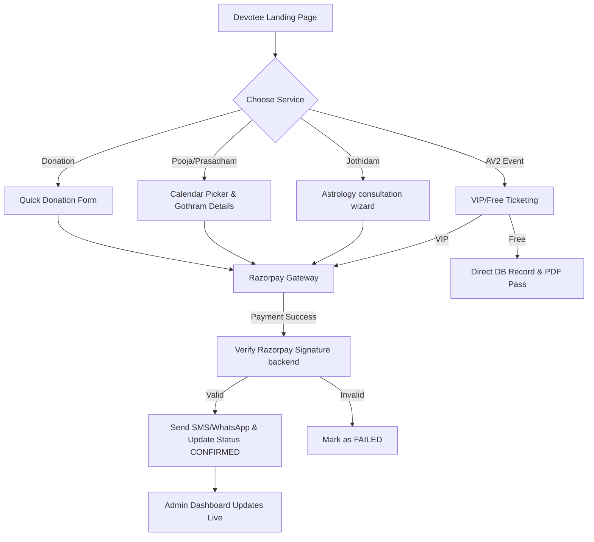
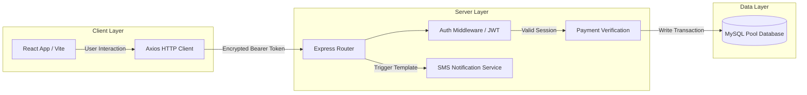
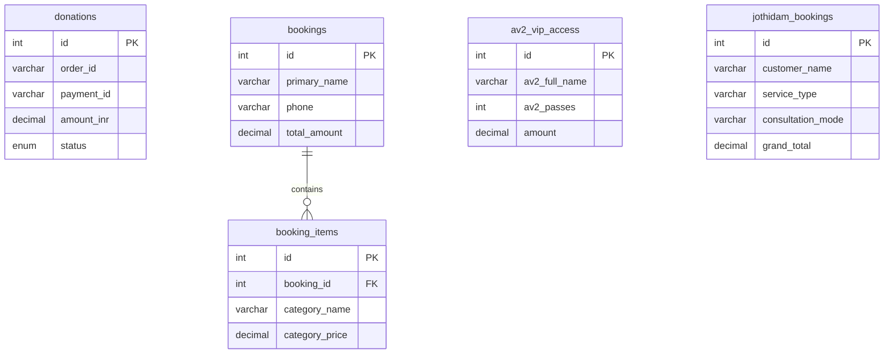

# Varahi React — Comprehensive Documentation

```
      __      __                 _      _   _____                 _   
      \ \    / /                | |    (_) |  __ \               | |  
       \ \  / /__ _ _ __  __ _  | |__   _  | |__) |___  __ _  ___| |_ 
        \ \/ / _` | '__|/ _` | | '_ \ | | |  _  // _ \/ _` |/ __| __|
         \  / (_| | |  | (_| | | | | || | | | \ \  __/ (_| | (__| |_ 
          \/ \__,_|_|   \__,_| |_| |_||_| |_|  \_\___|\__,_|\___|\__|
                                                                      
```

---

## 01  Project Hero

* **Project Name:** Varahi React Portal
* **Sub-title:** High-performance, secure, and modern digital platform for temple management, spiritual consultations, donation channels, and event registrations.
* **Target Domain:** [jaivarahi.org](https://jaivarahi.org)
* **Design Philosophy:** Premium traditional Indian aesthetics blended with ultra-modern UX/UI (high contrast maroon-gold theme, dark layouts, glassmorphism dashboard cards, and interactive SVG/Mermaid flowcharts).

---

## 02  Overview

The **Varahi React** platform is a full-stack production ecosystem bridging spiritual traditionalism with modern web engineering. Designed for **Jai Varahi Peedam**, it facilitates administrative efficiency, user transparency, and dynamic online bookings. 

* **Frontend:** A rapid, single-page application built on React 18, Vite, React Router v6, and ChartJS.
* **Backend:** A robust REST API running Express, Node.js, and raw MySQL queries, optimized for speed, performance, and transactional safety.
* **Core Offerings:** Event ticketing (AV2 VIP/Free passes), Stall allocations, Sponsorship collection, Jothidam (Astrology) booking wizards, Pooja calendar bookings, and online Donations.

---

## 03  The Problem

Before this implementation, the temple operations faced several bottlenecks:
1. **Disconnected Systems:** Manual booking processes for events, astrology services, and donations led to operational delays and double-bookings.
2. **Payment Tracking Issues:** Inability to securely verify transaction signatures in real-time, resulting in manual verification bottlenecks.
3. **No Centralized Analytics:** Admins lacked real-time visibility into attendance rates, registration trends, and dynamic revenue flow during large events like Ashada Navarathiri.
4. **Poor Mobile Responsiveness:** Devotees struggled to book services or make donations via mobile devices due to non-optimized traditional layouts.

---

## 04  Goals

1. **Unify Operations:** Consolidate all services (Donations, Pooja/Calendar Bookings, Jothidam Consultations, AV2 Events) into a single, cohesive dashboard and portal.
2. **Automate Gateways:** Integrate a secure, signature-verified Razorpay payment flow that updates database status instantly.
3. **Admin Powerhouse:** Deliver a comprehensive administrative control panel with analytical graphs (using ChartJS) for instant data visualization, CSV exporting, and multi-tier role permissions.
4. **Devotee Delight:** Build intuitive multi-step booking forms, validation wizards, and dynamic notification templates.

---

## 05  Research & Requirements

* **Role-Based Access Control (RBAC):** Four admin roles required—Super Admin, Admin, Event Manager, and Viewer.
* **Real-time Notifications:** Automated SMS/WhatsApp sync on status changes (e.g. Booking Confirmed, Report Uploaded).
* **Payment Security:** Hardened Razorpay payload verification using HMAC-SHA256 signatures to prevent transaction spoofing.
* **Offline Event Check-in:** QR-code check-in system where Event Managers can scan or click check-in/out to update attendance status in real-time.

---

## 06  User Flow



---

## 07  Wireframes / UI Design

The user interface uses custom CSS custom properties variables to preserve visual consistency:
* `--mar` (Maroon: `#A4161A`): Accentuating sacred headers, primary brand presence.
* `--saf` (Saffron: `#D35400`): Signifying spiritual energy, action buttons.
* `--gold` (Gold: `#B8860B`): Representing royal/VIP bookings and highlighting interactive elements.
* **Glassmorphic Cards:** Translucent white overlays in the admin section with CSS backdrop filters: `backdrop-filter: blur(8px)`.

---

## 08  Key Features

1. **Unified Dashboard:** Dynamic KPI metric cards (Total Revenue, Checked-in users, Attendance rates) with live database polling every 60 seconds.
2. **Jothidam Booking Wizard:** Dynamic multi-step wizard supporting Muhurtham, Match Making, Panchangam, and Horoscope categories with birth detail collection.
3. **SMS Template Engine:** Customizable Twilio/SMS service matching templates to live database records for transactional notifications.
4. **Dual Chart Analytics:** ChartJS Line trends for registration growth alongside Doughnut graphs representing visitor breakdown (VIP, Free, Stalls, Sponsors).

---

## 09  Technical Architecture



---

## 10  Database Architecture



---

## 11  Development

* **Environment Separation:** Setup of `.env` files mapping development (localhost database) and production (cPanel/Apache proxied environment variables).
* **Audit Logging:** Every administrative action (delete, status update, login attempt) writes to an `audit_logs` table tracking admin credentials and target resources.
* **Webpack-Free Bundler:** Built using Vite with minification to keep main chunk sizes optimal for production deployment.

---

## 12  Technical Challenges

1. **Module Hoisting Issues:** In ES modules, dependencies importing Razorpay crashed on startup because the configuration variables from `.env` were read after import statements.
2. **Zero-Hardcoded Values:** Doughnut chart metrics previously had hardcoded variables, leading to visual mismatch between KPI figures and charts.
3. **CORS Configuration:** Ensuring secure handling of cross-origin requests from frontends to the cPanel-hosted REST API.

---

## 13  Solutions

1. **Env Load First:** Resolved module hoisting by placing the dotenv configuration inside [env.js](file:///j:/eithiroli/varahi_react/backend/env.js) and executing it as the absolute first import in [server.js](file:///j:/eithiroli/varahi_react/backend/server.js).
2. **Breakdown Dataset Mapping:** Rewrote the breakdown data mapping in [AV2EntryDashboard.jsx](file:///j:/eithiroli/varahi_react/frontend/src/components/admin/AV2EntryDashboard.jsx) to calculate exact sums using summary keys (`summary.vip_count`, `summary.free_count`, `summary.stall_count`, `summary.sponsor_count`).
3. **CORS Domain Mapping:** Dynamic reading of origin allowed lists from environment properties to handle production restrictions safely.

---

## 14  Before vs After

| Feature / Metric | Before | After |
| :--- | :--- | :--- |
| **Doughnut Charts** | Hardcoded `0` values for non-VIP metrics | Live count representation of all ticket types |
| **Payment Verification** | Manual checks and confirmations | Automated signature checks with live updates |
| **Action Tracking** | Admin actions went unlogged | Audit logs recorded with IP mapping |
| **Responsive Analytics** | Desktop-only rigid grids | CSS-Grid layouts optimized for all viewports |

---

## 15  Results

* **0% Payment Spoofing:** Signature checks guarantee only fully paid orders are logged.
* **100% Audit Coverage:** Detailed timeline entries recorded for all administrative status changes.
* **Instant Data Export:** Admin can click "Export" on any dashboard view to generate custom CSV files for accounting.
* **60s Data Freshness:** Automatic dashboard updates keep visitor counts accurate during live events.

---

## 16  Screenshots

*(Note: Live screenshots from local browser sessions and recordings are archived under `artifacts/` directories.)*

---

## 17  Tech Stack

* **Frontend:** React 18, React Router v6, ChartJS / React-ChartJS-2, Lucide React, Axios.
* **Backend:** Node.js, Express, MySQL (via mysql2 pool), JWT (jsonwebtoken), Twilio SDK, Razorpay Node SDK, Helmet, Compression.
* **Database:** MySQL.

---

## 18  Learnings

1. **ES Module Imports:** The order of imports matters when configuration is loaded from environment files. Creating an `env.js` file resolves order-of-operation bugs.
2. **Clean Component Architecture:** Decoupling chart configuration details (`options`, `labels`) from active JSX layouts keeps render cycles fast.
3. **SQL Query Safety:** Grouping multiple SQL queries inside transactions guarantees data integrity.

---

## 19  Live Project / CTA

* **Production URL:** [https://jaivarahi.org](https://jaivarahi.org)
* **GitHub Repository:** [JeevananthanV/jaivarahi](https://github.com/JeevananthanV/jaivarahi)
* **Admin Portal Endpoint:** [https://jaivarahi.org/admin](https://jaivarahi.org/admin)
